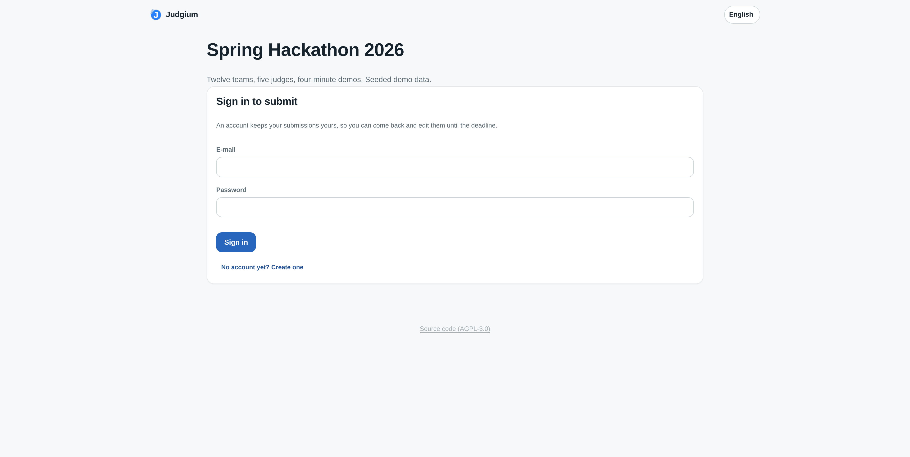
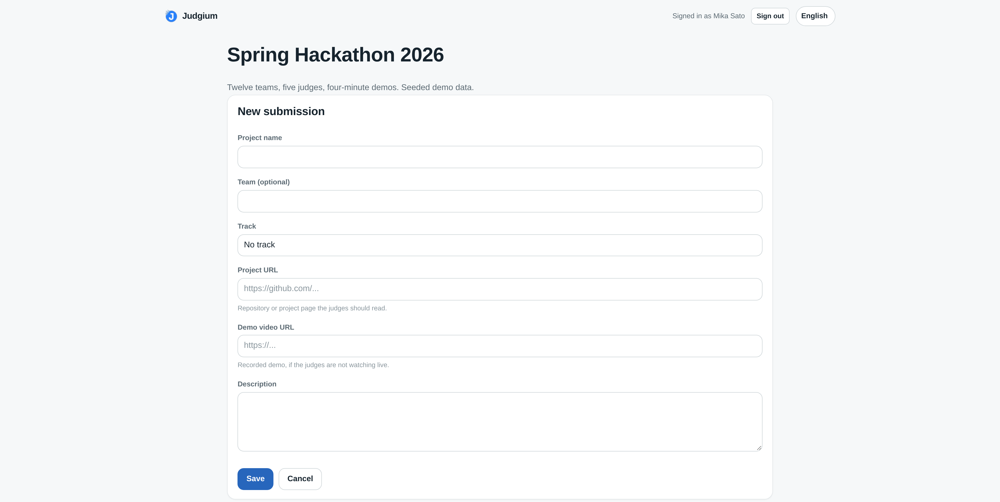

[English](README.md) · **日本語**

> 挑戦を、正しく届ける、作品と評価が出会う場所。
> Every challenge conveyed fairly — where projects and judging meet.

[](https://github.com/judgium/judgium/actions/workflows/ci.yml)
[](LICENSE)
[](DCO)
[](package.json)

Judgium は、ハッカソン作品の登録から審査、最終集計までを一つにつなぐジャッジング
プラットフォームです。参加者は自分で作品を応募し、審査員はそれぞれ専用の非公開リンクで
各評価項目を採点します。会場でピッチを見ながらでも、録画デモとリポジトリを自分の
ペースで読みながらでも構いません。終わった時点でリーダーボードが完成しています。

Node.js + Express + SQLite。ビルドステップなし、フレームワークランタイムなし、
実行時依存は 2 つ（`express`、`better-sqlite3`）、開発時依存は 1 つ（ページテスト用の
`jsdom`）だけです。**Azure App Service（Linux、組み込み Node ランタイム）** を
想定していますが、ノート PC 上でも同じように動きます。

---

## クイックスタート

```bash
npm install
npm run seed     # 任意: 12 エントリ・5 審査員のデモハッカソンを作成
npm start        # http://localhost:3000
```

`npm run seed` は主催者の認証情報、全審査員のリンク、公開リーダーボードの URL を
出力します。`npm run dev` でウォッチモード、`npm test` でテストスイート（108 件:
採点ロジック、API、並行性、永続化、プラットフォーム管理、そして jsdom で駆動する
5 ページ分 — 実ブラウザもネットワークも不要）が走ります。

## 6 つの画面

| 画面 | URL | 開く人 |
|---|---|---|
| ランディング / サインイン | `/`、`/login`、`/signup` | 主催者 |
| 主催者コンソール | `/admin` | 主催者（セッション Cookie） |
| 応募ページ | `/enter/<slug>` | 参加者 — 自分のアカウントで自分の作品を |
| 審査員スコアカード | `/j/<token>` | 審査員 — アカウント不要・インストール不要 |
| 公開リーダーボード | `/board/<slug>` | デモ会場のスクリーン、チーム、スポンサー |
| プラットフォーム管理 | `/sysadmin` | この環境を運用する人 |

## 画面イメージ

いずれも `npm run seed` が作るデモデータなので、写っている名前やスコアはすべて
架空のものです。実際のイベントが進む順に並べています。**画面は英語表示です**が、
日本語・スペイン語・中国語・韓国語にも対応しており、全ページ右上のトグルで
切り替えられます。

### 準備

**評価基準。** 項目ごとに満点と重み。これは重み付けモードで 100 点満点、
ポイントモードで 60 点満点になる 25/20/20/15/10/10 の評価基準です。両方の数値が
保存されているので、何も再入力せずにモードを切り替えられます。


**審査員。** 審査員 1 人につき 1 本の非公開リンク。個別にも一括でもコピーできます。
各行に進捗、リンクが開かれたかどうか、スコアカードの再開・リンクの再発行（旧リンクは
即時失効）・その審査員のスコア消去のボタンが並びます。スポンサー審査員 2 名は
トラックに限定されているため、分母が他の 12 に対して 9 と 7 になっています。


### 応募の受付

**主催者 — 受付を開く。** チェックボックス 1 つで、ボードのリンクの隣に応募リンクが
現れます。重要なのは補足文です。これを OFF にすることが**締切そのもの**で、追加・
編集・取り下げが同時に止まります。


#### 参加者が `/enter/<slug>` で見る画面

参加者が出会う順に 3 状態。これが参加者向け画面のすべてで、他のページはなく、
コンテストの一覧を閲覧することもできません。

**1. リンクを開いた直後。** まだアカウントがないので、コンテスト名を示してサインインを
求めます。アカウント作成は受付が開いている間しかできません。これにより、主催者が
受付を開いていないコンテストに対してアカウントを作られることがありません。



**2. 作品を応募する。** 作品名、チーム名、主催者が定義したトラックからの選択、審査員が
開くリポジトリと録画デモの URL、そして説明。テーブル番号は含まれません。あれは
デモ会場で主催者がチームを座らせる場所だからです。



**3. 後から戻ってくる。** 自分の応募だけが並び（他人の応募は見えません）、締切まで
編集も取り下げもできます。下部には **Add a submission** が残っており、1 アカウントで
何件でも応募できます。


**主催者 — 届いたもの。** エントリタブでは、参加者の応募と主催者が手で入れた行が
同じ一覧に並びます。Aurora と EchoNotes は応募ページ経由なので応募者名が表示され、
残り 10 件は主催者が登録したもので応募者欄が空です。


### デモの最中

**審査員スコアカード** — 審査員が自分のリンクから開く画面です。アカウント登録も
インストールも不要で、他の審査員の情報は一切表示されません。上部の作品チップが
採点済みの作品を示し、その下に 1 作品が開いて評価項目ごとの入力欄と各項目の説明文が
並び、前後ボタンで移動します。表示されているのは参加者が応募した作品なので、説明文と
2 つのリンクが付いています。ライブのピッチではなく録画から審査できる状態です。この
カードは提出済みなので、**Mark as complete** ではなく **Reopen my scorecard** が
表示されています。


**公開リーダーボード** — デモ会場のスクリーンに映す画面です。順位、作品名、チーム、
トラック、スコアに加えて相対位置を示すバー、トラックフィルタ、ライブ表示、
プロジェクタ用の全画面ボタン。ここに*写っていない*ものに注目してください。
審査員名なし、審査員別スコアなし、フィードバックなし。これが「セキュリティに関する
注記」で保証している内容の実際の見た目です。3 位と 4 位は 0.03 差で、こういう差が
出るからこそ審査員別エクスポートを残す価値があります。


### 発表

**結果。** 同じ順位表を主催者の視点で見たもの。行ごとに
`採点済み審査員数 / 対象審査員数`、各リンクの先に審査員別内訳、そして 4 種の
エクスポート。4 位が 5 / 5 で 1 位が 3 / 4 になっています。部分的なスコアカードも
ライブの数値に反映され、行はそれを隠さず明示します。


### 環境の運用

**プラットフォーム管理。** テナント横断のカウンタ、ワンクリックバックアップ付きの
ストレージ・耐久性情報、そして別タブにアカウント・大会・追記専用の監査ログ。
`SESSION KEY: stored on disk` は「データ、耐久性、バックアップ」で説明した 3 つの
ケースのうち 2 番目です。


## データ、耐久性、バックアップ

すべて — アカウント、大会、評価基準、エントリ、審査員、スコア、コメント — が
1 つの SQLite ファイル（既定は `./data/judgium.db`）に入っています。
**そのファイルがあるディレクトリを永続化すれば何も失われません**。同じ場所に
ライトアヘッドログ、セッション署名鍵、バックアップフォルダも置かれます。

```bash
npm run backup                 # data/backups/ にスナップショットを作成
npm run backup -- /tmp/out.db  # 出力先を指定する場合
```

バックアップは SQLite の `VACUUM INTO` を使い、読み取りトランザクション内で実行
されるため、審査員が採点中の稼働インスタンスに対しても安全に取得できます。WAL が
開いている状態で `judgium.db` を手でコピーするのは安全ではありません。復元するには
サーバーを停止し、スナップショットを `judgium.db` に上書きコピーして `-wal` /
`-shm` のサイドカーファイルを削除します。正確なコマンドは `npm run backup` の出力に
表示されます。

**セッション。** 主催者のセッション Cookie は次の優先順で解決された鍵で署名されます。
`SESSION_SECRET`、次に一度だけ生成して `<データディレクトリ>/session-secret`
（パーミッション `0600`）に保存された鍵、そして — そのディレクトリが書き込み不可の
場合のみ — プロセスごとのランダムな鍵です。前 2 つは再起動後も維持されます。
3 つ目は再起動ごとに全員をサインアウトさせるため、アカウントや大会には何も起きて
いないのにデータが消えたように見えます。起動ログと `/sysadmin` の概要画面の両方に、
3 つのうちどれが有効かが表示されます。

**スキーマ変更。** `src/db/schema.sql` は新規データベース用のベースラインで、
すべて `CREATE ... IF NOT EXISTS` なので、既存のテーブルを変更することはできません。
既存テーブルに手を入れる変更は `src/db/migrations.js` に記述します。これは起動時に
実行され、各変更をトランザクション内で一度だけ適用し、`schema_migrations` に記録
します。したがってカラムの追加は、黙って何もしないのではなく、既存環境をその場で
アップグレードします。

## プラットフォーム管理

`/admin` は主催者自身の大会だけを対象とします。`/sysadmin` は環境全体に対する
運用者の視点であり、意図的に別ページになっています。プラットフォーム管理者が他人の
データを見ている最中に、どちらの文脈にいるかを取り違えないようにするためです。

ロールは 2 つ。`organizer`（既定 — 自分の大会を所有）と `superadmin`
（テナント横断）です。プラットフォーム画面では次のことができます。

- **概要** — 全テナントのアカウント・大会・エントリ・審査員・スコア数、稼働中の
  SSE 購読者数、上記のストレージと耐久性の情報、ワンクリックバックアップ。
- **アカウント** — 全アカウントの検索と絞り込み、昇格と降格、停止と復帰、
  パスワードリセット、アカウントの直接発行（セルフサービス登録が開いているかに
  関わらず）、データごとの削除。
- **大会** — 所有者付きの全大会一覧（検索可）、任意の大会のクローズ・再開・削除。
- **監査ログ** — すべての管理操作の追記専用の記録。実行者、対象、IP を含みます。
  参照先のアカウントが削除された後も残ります。

最初の superadmin の付与には別経路が必要です。このロールにセルフサービスの経路は
なく、新規環境には付与できる人が誰もいないためです。

```bash
SUPERADMIN_EMAILS=you@example.com npm start   # 起動時とサインアップ時に昇格
npm run promote -- you@example.com            # CLI からいつでも実行可能
npm run promote -- you@example.com --revoke
npm run promote -- --list
```

UI だけでなく API 側でも強制されるガードレール:

- 停止されたアカウントはサインインできません。既に発行済みの Cookie も、期限切れを
  待つのではなく次のリクエストで拒否されます。データはそのまま保持され、復帰時に
  戻ります。
- 管理者は自分自身のアカウントを降格・停止・削除できません。これが管理者ゼロに
  到達する唯一の経路だからです。ロールは引き継ぐことしかできません。
- アカウントの削除は、その大会とエントリ・審査員・スコアに連鎖し、稼働中の
  リーダーボードストリームを閉じ、他のテナントには一切影響しません。

## イベントの運営

1. **大会を作成**（`/admin` → New competition）。スターター評価基準を選びます —
   一般ハッカソン、プロトタイピング週末、研究ハッカソン、または空白。
2. **評価基準を設定**（Rubric タブ）。各項目は自身の満点を持ち、重み付けモードでは
   自身のパーセンテージも持ちます。トラック固有の項目は、そのトラックのエントリに
   対して共通項目の上に追加されます。
3. **エントリを追加**（Entries タブ）。1 件ずつ、または
   `作品名 | チーム | トラック | テーブル` を 1 行ずつ貼り付けて一括登録。未知の
   トラックは自動作成されます。エントリ数・チーム数に上限はありません。
4. **審査員を追加**（Judges タブ）。各審査員に非公開リンクが発行されます。
   `名前 | メール` の行を貼り付けて審査員団を一括登録できます。全リンクの一括コピーも
   個別コピーも可能です。審査員数に上限はありません。
5. **ステータスを Live にして**リンクを共有します。大会が下書き状態のままでも審査員は
   採点できるので、リハーサルはこの状態で行います。
6. **デモ会場のスクリーンで `/board/<slug>` を開き**、全画面ボタンを押します。
7. **発表とエクスポート**（Results タブ）。5 種類あり、それぞれ別の問いに答えます。

   | ファイル | 何が分かるか |
   |---|---|
   | `leaderboard.csv` | 誰が勝ったか。評価項目ごとの平均つき |
   | `entries.csv` | 何が応募されたか — 説明・リポジトリ・録画デモ・応募者、エントリ順 |
   | `per-judge.csv` | どの審査員がどの作品に何点を付けたか。コメントつき |
   | `notes.csv` | フィードバックのみ |
   | `full.json` | 全部。スクリプトで読む用 |

   CSV 3 種は UTF-8 BOM 付きで Excel が CJK を正しく開き、先頭の `=` `+` `-` `@` を
   無効化して数式インジェクションを防ぎます。

審査員には 1 エントリずつ、評価項目ごとの数値入力欄、フィードバック欄、前後ナビ
ゲーションが表示されます。スコアは入力しながら保存されます。**Mark as complete** で
スコアカードを提出します。未完成のカードは強制提出する前に警告が出ます。主催者は
スコアカードを再開したり、特定の審査員のスコアをクリアしたり、新しいリンクを発行
（旧リンクは即時失効）したりできます。

## 参加者による応募

エントリは主催者が登録しても、参加者が自分で応募しても、同じコンテスト内で両方が
混在しても構いません。**何も勝手には開きません。** `submissionsOpen` は既定で OFF で、
アップグレードしても既存コンテストの状態は変わりません。

1. **受付を開く**（設定タブ →「参加者からの応募を受け付ける」）。応募リンク
   `/enter/<slug>` が表示されます。ボードのリンクと並び、同じ形です。
2. **配布する。** 参加者はそこを開き、アカウントを作成して応募します。コンテストの
   公開一覧はありません。審査員がスコアカードにたどり着く方法と同じで、リンクだけが
   入口です。
3. **受付を閉じる。** このフラグを OFF にすることが**締切そのもの**です。新規登録・
   編集・取り下げが同時に不可になります。提出済みの内容は引き続き閲覧できます。

参加者が設定できるのは、作品名・チーム名・トラック（主催者が定義したものから選択）・
説明・リポジトリURL・録画デモURL です。設定**できない**のは、デモ会場の座席にあたる
テーブル番号と、他人の応募です。

**上限なし・重複チェックなし・承認なし。** 1つのアカウントが同じコンテストに何件でも
応募できます。1チームに複数回の挑戦を認めるハッカソンは珍しくなく、同名の応募が2件
あってもそれは誤りではないからです。主催者が承認する待ち行列もありません。審査員が
「採点に値しない」と判断した作品は手を付けずに残せばよく、どの審査員も採点しなかった
作品は順位が付かずボードの最下部に沈みます。フィルタは審査員団そのものです。

エントリタブには誰が何を応募したかが名前で表示されます。主催者自身が追加した
エントリには応募者が表示されません。

**参加者アカウントからは他に何も見えません。** `/admin` に入れず、コンテストを作成
できず、エクスポートもできず、他の参加者の応募も読めません。UI 任せにせず
`test/participant.test.js` で検証しています。

## ライブ審査と非同期審査

評価基準もリーダーボードも同じものが両方に使えます。違うのは審査員が何を見るかだけ
です。

| | 会場でのピッチ | 各自のペースで読む |
|---|---|---|
| テーブル番号 | デモ会場の座席に使う | 空でよい |
| リポジトリ・動画URL | 任意 | **これが応募内容** |
| 採点・集計・ボード | 同一 | 同一 |

審査員スコアカードは全エントリについて説明文と2つのURLをリンクとして表示するので、
誰もプレゼンしなくても録画デモとリポジトリで審査できます。エントリのURLは
`http(s)` のみ許可し、`javascript:` と `data:` は拒否されます。

## 採点モデル

**評価項目ごと。** `points` モードは各項目の素点を合計します（10 + 8 = 18）。
`weighted` モードは項目ごとに `スコア / 満点 × 重み` を寄与させるので、
`.devcontainer/app-design/app-design.md` の評価基準（25/20/20/15/10/10）では
100 点満点のスコアになります。満点と重みは全項目について両方保存されるため、
評価基準を再入力せずにモードを切り替えられます。

**審査員ごと → エントリごと。** 審査員の合計点は既定では平均され、ポイントプール方式を
好む場合は合計にできます。**最高点・最低点の除外**は、審査員合計の最大値 1 つと
最小値 1 つを除きます。これは 3 人以上がそのエントリを採点した時点で初めて有効に
なるので、少人数の審査員団を消してしまうことはありません。除外された値はデータベースと
審査員別エクスポートには残り、変わるのはリーダーボードの数値だけです。

**部分的なスコアカードも集計されます。** あるエントリについて一部の項目だけ入力した
審査員も、空欄をゼロとして集計に含まれます。そのため誰かが完了した時だけでなく、
デモの最中にボードが動きます。各行は `採点済み審査員数 / 対象審査員数` も表示するので、
部分的な結果が部分的だと分かります。

**順位付け。** スコアの高い順。同点は同順位を共有し、次の順位はその分スキップされます。
誰にも採点されていないエントリは順位を持たず、最下部に沈みます。

**トラック**は任意です。トラック割り当てのない審査員は全エントリを採点します。
トラックに割り当てられたスポンサー審査員は、そのトラックのエントリとトラック未設定の
エントリを見ます。API は有効なエントリ ID であってもトラック外への書き込みを拒否します。

## 対応言語

英語、日本語、スペイン語、中国語、韓国語。全ページ右上のトグルで切り替えられます。
文字列は `public/i18n/<locale>.json` にあり、テストスイートが 5 ファイルすべてが
まったく同じキーと同じ補間プレースホルダを定義していることを検証するため、翻訳漏れは
リリースされる前に CI で落ちます。審査員の言語選択はリンクに紐づけて保存されるので、
2 台目のデバイスでも引き継がれます。エクスポートは UTF-8 BOM 付きなので、Excel で
CJK が正しく開きます。

## 並行性とキャパシティ

審査員団の規模はどこにもハードコードされていません。上限は起動時にホストから導出され、
起動時に出力されます。

```
detected host     8 CPU / 5.33 GB -> up to 3200 live viewers per instance
board refresh     coalesced to at most 1 push / 150ms
```

- **ライブ更新**は Server-Sent Events を使い、大会ごとに 1 トピックです。上限は検出
  されたメモリと CPU から決まります（`MAX_LIVE_CLIENTS` で上書き可）。上限に達すると
  サーバーは `503 live_capacity` を返し、ページは自力でポーリングにフォールバック
  します — どちらにしてもボードは更新され続けます。タブが非表示の間はストリームも
  停止します。
- **リーダーボードの再計算はまとめられます。** 審査員団全員が同時に入力しても、
  キーストロークごとではなく、スロットル窓ごとに最大 1 回の再計算とプッシュになります。
  結果は大会の `rev` カラムに対してメモ化されるため、繰り返しの読み取り（各審査員の
  進捗バー、デモ会場のスクリーン、管理テーブル）は実際に何かが変わるまでコストゼロです。
- **書き込み**は WAL モードの SQLite に対して、5 秒の busy タイムアウトで行われるため、
  リーダーボードの読み取りが審査員をブロックすることはありません。スコアの書き込みは
  `(審査員, エントリ, 評価項目)` をキーとした upsert です。同じ審査員からの重複した
  保存が 2 つあっても、一方が他方を上書きするのではなく両方が反映されます。
- **審査員の自動保存はエントリ単位でまとめられます。** 6 項目をタブ移動すると
  リクエストは 1 回。保存が失敗しても、その後のキーストロークを失わずに再試行されます。
- **レート制限**は IP 単位で、CPU 数からサイズが決まり、読み取りと書き込みで別々です。
  全体的なクォータを課すためではなく、暴走ループを鈍らせるために存在します。

`test/concurrency.test.js` で検証済み: 15 審査員 × 20 エントリ × 4 評価項目を並行
書き込みしてセルの欠落ゼロ、40 の同時 SSE 視聴者すべてがストリームを受信、
250 エントリのリーダーボードが十分な余裕を持って描画。

**スケールアウト時の注意。** SSE の購読者はインスタンスごとに保持されます。1 回の
審査セッションであれば 1 インスタンスが正解です。プロビジョニングスクリプトは
セッションアフィニティも有効にするため、スケールアウトしたプランでも視聴者は自分に
配信しているインスタンスに固定され、残りはポーリングフォールバックが受け持ちます。

## Azure App Service へのデプロイ

```bash
./deploy/provision-azure.sh <resource-group> <app-name> <location>
```

このスクリプトは Linux プランを作成し、ランタイムと起動コマンドを設定し、Always On を
有効にし、ヘルスチェックを `/healthz` に向け、セッションアフィニティと HTTPS のみを
有効にし、`SESSION_SECRET` を生成します。その後デプロイします。

```bash
az webapp up --name <app-name> --resource-group <resource-group>
```

あるいは `.github/workflows/azure-webapp.yml` を設定して `main` にプッシュします。
認証は OIDC なので、長期資格情報をリポジトリに置きません。必要なのは機密でない
リポジトリ変数 4 つと、Azure 側のフェデレーション資格情報だけです。

```
vars.AZURE_CLIENT_ID  AZURE_TENANT_ID  AZURE_SUBSCRIPTION_ID  AZURE_WEBAPP_NAME
```

デプロイジョブは `environment: production` を宣言しているため、フェデレーション
資格情報の subject は `repo:<owner>/<repo>:environment:production` でなければ
なりません（`ref:refs/heads/main` では**ありません**）。ここを間違えるとサインイン
ステップが `AADSTS70021` で失敗します。

App Service で重要なのは 3 点です。

- **`DATABASE_PATH=/home/data/judgium.db`。** `/home` が永続共有領域です。
  `/home/site/wwwroot` 配下はデプロイ時に置き換えられ、Run-From-Package では
  読み取り専用になります。
- **`SESSION_SECRET` は必ず設定してください。** 設定しないとサーバーは起動時に
  ランダムな鍵を生成して警告を出し、主催者のセッションは再起動ごとに失われます。
- **依存関係は Linux 上でインストールしてください。** `better-sqlite3` v13 は npm
  tarball の中に全プラットフォーム向けのビルド済みバイナリを同梱しており、ローカル
  ビルドより優先してそれを読み込むためコンパイラは不要です。ただしバイナリは
  プラットフォーム固有なので、macOS や Windows でビルドした `node_modules` を
  zip に含めては絶対にいけません。Oryx ビルド
  （スクリプトが設定する `SCM_DO_BUILD_DURING_DEPLOYMENT=true`）、`az webapp up`、
  または同梱の Linux CI ワークフローを使ってください。

  `.npmrc` が `ignore-scripts=true` を設定しているのはこのためです。そうしないと
  npm は、パッケージに `binding.gyp` が含まれているという理由だけで暗黙の
  `node-gyp rebuild` を実行し、3 秒のインストールが数分のコンパイルに変わり、
  Python と C++ ツールチェインのないイメージでは失敗します。この設定は
  `npm start` や `npm test` には影響しません。

推奨ターゲットは Linux です。`web.config` は Windows App Service 用に同梱して
いますが、そこでは iisnode がレスポンスをバッファリングするため、ライブボードは
ポーリングフォールバックに劣化します。

### 設定

全項目は `.env.example` をコピーして確認してください。存在すれば起動時に自動で
読み込まれ、実際の環境変数が優先されます。すべてに動作する既定値があります。
本番環境では、鍵をデータボリューム上に置かないよう `SESSION_SECRET` を設定し、
`DATABASE_PATH` を永続ストレージに向けてください。

| 変数 | 既定値 | 用途 |
|---|---|---|
| `PORT` | `3000` | App Service が注入 |
| `SESSION_SECRET` | 一度生成しデータベースの隣に保存 | 主催者セッション Cookie の署名 |
| `DATABASE_PATH` | `./data/judgium.db` | SQLite ファイル。永続化すべきはそのディレクトリ |
| `BACKUP_DIR` | `<データディレクトリ>/backups` | `npm run backup` のスナップショット出力先 |
| `SUPERADMIN_EMAILS` | 空 | 起動時にプラットフォーム管理者へ昇格するアカウント |
| `PUBLIC_BASE_URL` | リクエストから導出 | 審査員リンクの生成に使用 |
| `SOURCE_URL` | このリポジトリ | フッターのソースリンクの宛先。**コードを改変したら設定必須** — AGPL-3.0 § 13 |
| `MAX_LIVE_CLIENTS` | 自動サイズ決定 | インスタンスごとの SSE 上限 |
| `RATE_LIMIT_READ` / `_WRITE` | 自動サイズ決定 | IP ごとの毎分リクエスト数 |
| `LEADERBOARD_THROTTLE_MS` | 自動サイズ決定 | ボードプッシュの最小間隔 |
| `LEADERBOARD_MAX_ROWS` | `0`（無制限） | 1 ボードペイロードの行数上限 |
| `DISABLE_SIGNUP` | `0` | 主催者登録を閉じる |
| `SIGNUP_ALLOWLIST` | 空 | 特定メールアドレスのみ登録を許可 |

## セキュリティに関する注記

- 審査員リンクは 24 文字のベアラートークンで、紛らわしい文字を除いたアルファベット
  （`0`/`1`/`i`/`l`/`o` を含まない）から生成され、審査員ごとに再発行できます。
  審査員ページは `noindex` です。
- 主催者のパスワードはパスワードごとのソルト付きで scrypt ハッシュされます。
  セッションは HMAC 署名付き Cookie で、`httpOnly`、`sameSite=lax`、プロキシ配下では
  `secure` です。
- 所有権チェックの失敗は `404` を返すため、大会 ID を探ることはできません。
  プラットフォーム管理 API は代わりに `403` を返します。経路は公知でも、権限はそう
  ではないからです。
- サインイン時、停止状態の確認はパスワードの後に行われるため、どのアドレスに
  アカウントがあるかを調べる手段にはなりません。
- `superadmin` ロールにセルフサービスの経路はありません。付与できるのは
  `SUPERADMIN_EMAILS`、`promote` CLI、既存の管理者だけで、管理者は自分自身のロールや
  状態を操作できません。
- サインイン失敗とセッション期限切れは別のエラーコードなので、一方が他方の文言で
  報告されることはなく、パスワード誤りと未知のアカウントは常に区別できません。
- すべてのページは厳格な CSP（`script-src 'self'`、`style-src 'self'`、
  `frame-ancestors 'none'`）の下で配信されます。フロントエンドは `innerHTML` に
  代入するのではなく DOM ノードを構築するため、主催者や審査員が書いたテキストが
  マークアップとして解釈されることはありません。
- CSV エクスポートは表計算ソフトの数式インジェクション対策として、先頭の `=`、`+`、
  `-`、`@` を無効化します。
- エントリの URL は `http(s)` でなければならず、`javascript:` と `data:` は拒否
  されます。
- 公開リーダーボードには、審査員名・審査員別スコア・フィードバックコメントが一切
  含まれません。

## プロジェクト構成

```
server.js                 プロセスのエントリポイント: listen、タイムアウト、正常終了
src/
  app.js                  express アプリ、セキュリティヘッダ、ルート、エラーハンドラ
  config.js               環境変数の解析 + ホストから導出するキャパシティ決定
  db/
    index.js              接続、pragma、バックアップ、サイズ
    schema.sql            新規データベースのベースライン
    migrations.js         既存データベースへの順序付き・一度だけの変更
  lib/
    scoring.js            評価基準の計算、最高最低の除外、順位付け、ボード整形
    events.js             SSE ハブ + 合流させる通知機構
    csv.js                エクスポート、エスケープ、Content-Disposition
    env.js                .env の読み込み + 永続セッション鍵
    audit.js              管理操作の追記専用の記録
    auth.js  ids.js  validate.js  ratelimit.js  templates.js  http.js  errors.js
  middleware/             Cookie、セッション、ロール、大会の所有権
  routes/                 auth, competitions, roster, judge, participant, public,
                          exports, sysadmin
  services/
    results.js            メモ化されたリーダーボード + 配信
    platform.js           superadmin の初期化 + テナント横断カウンタ
public/
  index|admin|enter|sysadmin|judge|board|404.html
  css/app.css             単一のスタイルシート、ライト + ダーク、モバイルファースト
  js/                     ES モジュール、バンドラなし
  i18n/                   en, ja, es, zh, ko
scripts/
  seed.js                 デモデータ
  promote.js              プラットフォーム管理者ロールの付与・剥奪
  backup.js               VACUUM INTO による一貫性のあるスナップショット
test/                     scoring, csv, lib, api, concurrency, persistence,
                          sysadmin, frontend (jsdom)
deploy/provision-azure.sh
docs/
  brand/                  マークとガイドライン - AGPL-3.0 の対象外
  screenshots/            README で使用する画面キャプチャ
```

## API

すべてのエンドポイントは JSON です。主催者向けルートはセッション Cookie が必要で、
審査員向けルートはパス中のトークンで認証されます。

```
POST   /api/auth/signup | login | logout        PATCH /api/auth/me
GET    /api/competitions                        POST  /api/competitions
GET    /api/competitions/:id                    PATCH /api/competitions/:id
DELETE /api/competitions/:id                    POST  /api/competitions/:id/reset-scores
POST   /api/competitions/:id/regenerate-slug
GET    /api/competitions/:id/results            GET   /api/competitions/:id/live      (SSE)
       /api/competitions/:id/{tracks,criteria,entries,judges}         CRUD + /reorder
POST   /api/competitions/:id/entries/bulk       POST  /api/competitions/:id/judges/bulk
POST   /api/competitions/:id/criteria/apply-template
POST   /api/competitions/:id/judges/:jid/{rotate-link,reopen,reset-scores}
GET    /api/competitions/:id/export/{leaderboard.csv,entries.csv,per-judge.csv,
                                     notes.csv,full.json}

GET    /api/judge/:token                        PATCH /api/judge/:token/entries/:entryId
POST   /api/judge/:token/{complete,reopen,locale}

GET    /api/enter/:slug                         POST  /api/enter/:slug/signup
POST   /api/enter/:slug/entries                 PATCH /api/enter/:slug/entries/:entryId
DELETE /api/enter/:slug/entries/:entryId

GET    /api/board/:slug                         GET   /api/board/:slug/live           (SSE)
GET    /api/meta                                GET   /healthz
```

プラットフォーム管理 — 以下のすべてのルートは `superadmin` ロールを必要とし、
すべての書き込みが監査ログに記録されます。

```
GET    /api/sysadmin/overview
GET    /api/sysadmin/users                      POST  /api/sysadmin/users
GET    /api/sysadmin/users/:id                  PATCH /api/sysadmin/users/:id
DELETE /api/sysadmin/users/:id                  POST  /api/sysadmin/users/:id/password
GET    /api/sysadmin/competitions               PATCH /api/sysadmin/competitions/:id
DELETE /api/sysadmin/competitions/:id
GET    /api/sysadmin/audit                      POST  /api/sysadmin/backup
POST   /api/sysadmin/bootstrap-superadmins
```

`GET /api/sysadmin/users` は `?q=&role=&status=&limit=&offset=` を受け取り、
`/competitions` は `?q=&status=&limit=&offset=` を受け取ります。
`PATCH /users/:id` は `{ name, locale, role, status }` のいずれかを受け付けます。

`PATCH /api/judge/:token/entries/:entryId` は自動保存用のエンドポイントで、部分的な
パッチ — `{ "scores": { "<criterionId>": 7.5 }, "notes": "…" }` — を受け取ります。
スコアに `null` を渡すとその評価項目がクリアされます。

## ライセンスと Judgium という名称

**コードは自由。名称とロゴはそうではありません。** これを意図的に 2 つの別文書に
分けています。

### コード: [AGPL-3.0-only](LICENSE)

使う、読む、改変する、自分でホストする、商用で運用する — 許可も費用も CLA も
不要です。伴う義務は 2 つです。

- **§ 5 — 改変版を配布する場合、それは AGPL-3.0 のままです。** 変更点を明示し、
  各種告知を保持してください。
- **§ 13 — サービスとして提供する場合、利用者が稼働中のバージョンのソースを取得
  できなければなりません。** Judgium は全ページのフッターにある
  `Source code (AGPL-3.0)` リンク（`/source` 経由でリダイレクト）でこれを実現して
  います。

> **改変したビルドを運用する場合は `SOURCE_URL`** を自身のリポジトリに設定して
> ください。未設定のままだと `/source` はこのプロジェクトを指します。これは無改変の
> ビルドにとっては正しい答えですが、改変版にとってはライセンス違反です。ここで最も
> やりがちなミスなので、HTML 5 ファイルの編集ではなく環境変数 1 つにしてあります。

MIT ではなく AGPL-3.0 にしているのは、Judgium がネットワークアプリケーションだから
です。このライセンスはサービスとして提供する者にも相互性の義務を及ぼしますが、MIT は
そうではありませんでした。イベントを自前で運用する人への実務的な影響はありません。

### ブランド: [TRADEMARKS.md](TRADEMARKS.md)

AGPL-3.0 § 7(e) は、コードを与えつつ商標を留保できるように存在しており、
[`NOTICE`](NOTICE) がまさにそれを行っています。狙いは限定的です。Judgium の稼働環境に
たどり着いた人が、それが我々のものかどうか判別できるようにする、ということだけです。

| | |
|---|---|
| 実行・改変・自前ホスト・周辺サービスの販売 | ✅ 許可不要 |
| プレーンテキストでの「Judgium のフォーク」「Judgium 上に構築」 | ✅ [§ 2](TRADEMARKS.md#2-nominative-use--always-permitted) |
| 「Compatible with Judgium」 | ✅ [5 つの条件](TRADEMARKS.md#5-compatible-with-judgium--permitted-under-conditions)の下で |
| 記事・教材・レビュー・批評を書く | ✅ 常に可 |
| 公開したフォークを Judgium と名乗る | ❌ [改名が必要](TRADEMARKS.md#4-forks-must-be-renamed) |
| 自分のサービスやフォークにロゴを使う | ❌ [§ 3(b)](TRADEMARKS.md#3-uses-that-require-our-written-permission) |

`docs/brand/` と `public/brand/` は **AGPL-3.0 の対象外**です —
[`docs/brand/LICENSE-BRAND`](docs/brand/LICENSE-BRAND) を参照してください。
このリポジトリのそれ以外はすべて AGPL-3.0 です。

Copyright © 2025–2026 Taiji Hagino. 「Judgium」および Judgium ロゴは
Taiji Hagino の商標です。

## プロジェクト文書

以下はいずれも英語で書かれています。

| | |
|---|---|
| [`CONTRIBUTING.md`](CONTRIBUTING.md) | 環境構築、マージする / しないものの基準、コーディング規約、DCO 署名 |
| [`GOVERNANCE.md`](GOVERNANCE.md) | 意思決定者、応答目標、スコープ、ライセンスを変更できない理由 |
| [`SECURITY.md`](SECURITY.md) | 脆弱性の非公開報告手順、対象範囲、運用者向けチェックリスト |
| [`TRADEMARKS.md`](TRADEMARKS.md) | 名称とロゴのルール。フォーク、互換性表記、許諾 |
| [`docs/brand/BRAND.md`](docs/brand/BRAND.md) | マーク、配色、余白、スクリーンショット |
| [`CODE_OF_CONDUCT.md`](CODE_OF_CONDUCT.md) | Contributor Covenant 2.1 と、審査プロジェクト固有の事項 |
| [`MAINTAINERS.md`](MAINTAINERS.md) | 領域ごとの `@` 宛先 — **es/zh/ko のネイティブレビュアー募集中** |
| [`CHANGELOG.md`](CHANGELOG.md) | 全リリースと、アップグレードの約束事 |
| [`DCO`](DCO) | `git commit -s` が証明する内容 |

不具合と機能要望: [issues](https://github.com/judgium/judgium/issues)。
自由な議論: [Discussions](https://github.com/judgium/judgium/discussions)。
脆弱性: issue では**なく** — [非公開で報告](https://github.com/judgium/judgium/security/advisories/new)。

## スポンサー

Judgium はフリーソフトウェアで、これからもそうです。表計算との格闘を一晩分
省けたと感じて、気が向いたときだけのチップ入れです。

[](https://www.buymeacoffee.com/taiponrock)

この先に何かがあるわけではありません。スポンサーになっても Issue の優先対応も、
マージ内容への影響も、他の人が得られない機能もありません。意思決定の実際は
[`GOVERNANCE.md`](GOVERNANCE.md) にあります。コーヒー代です。
