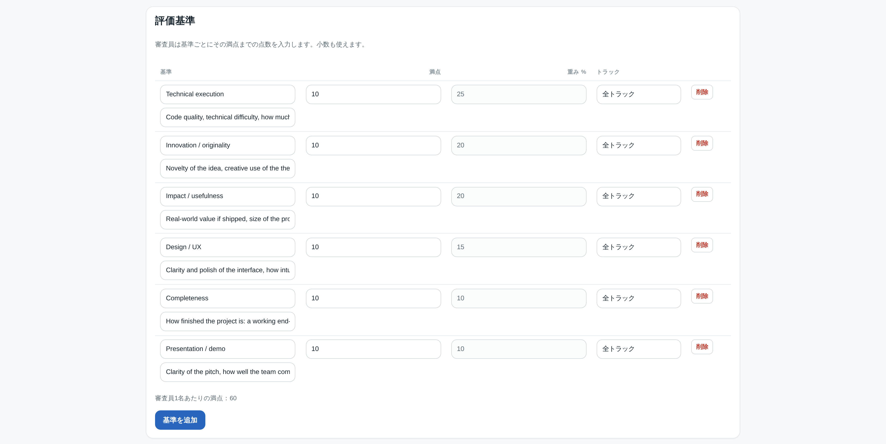
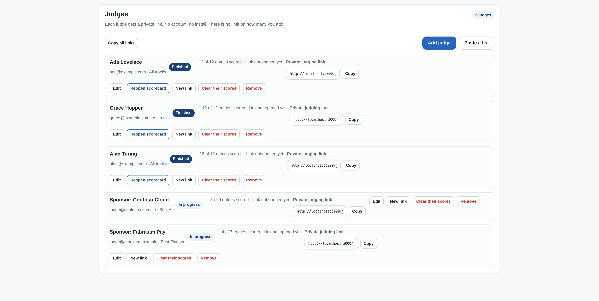
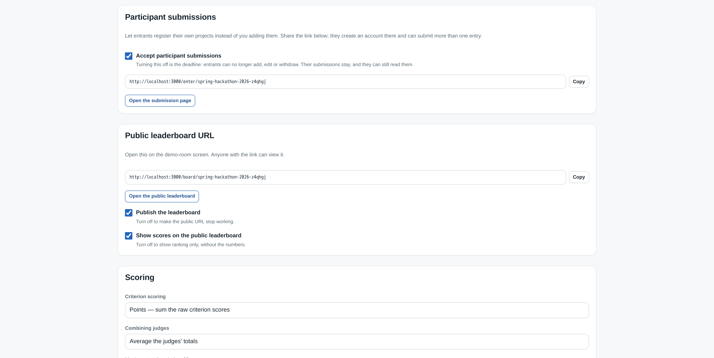
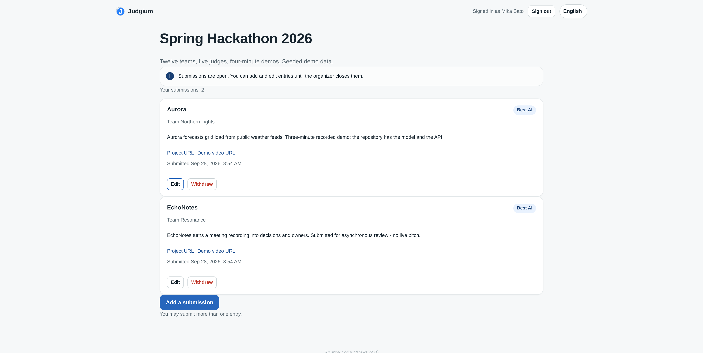
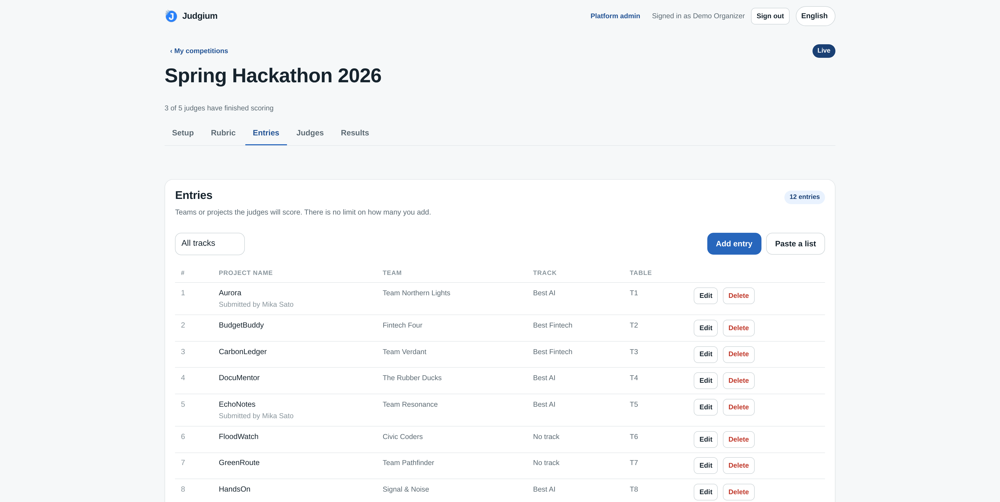
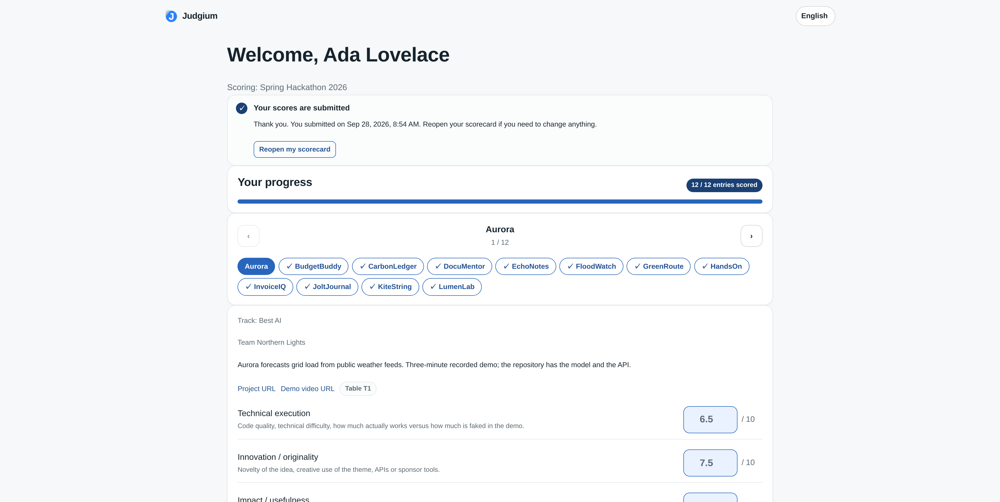
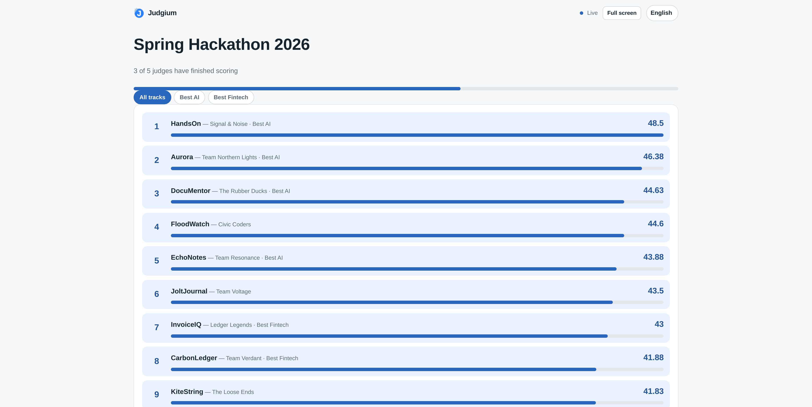
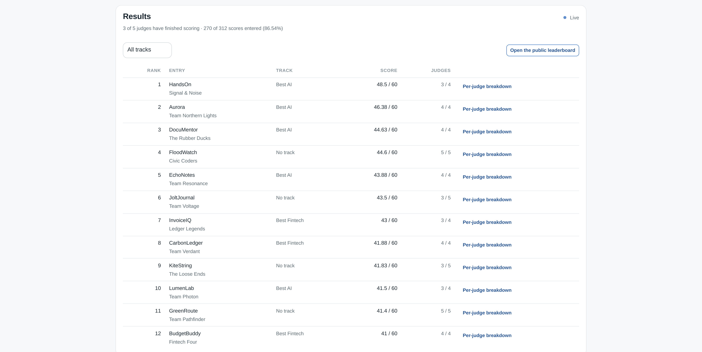
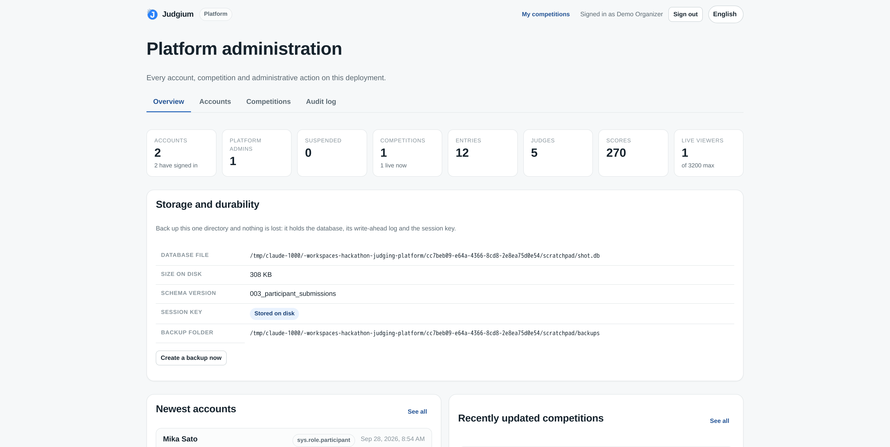

**English** · [日本語](README-ja.md)

> Every challenge conveyed fairly — where projects and judging meet.
> 挑戦を、正しく届ける、作品と評価が出会う場所。

[](https://github.com/judgium/judgium/actions/workflows/ci.yml)
[](LICENSE)
[](DCO)
[](package.json)

Judgium is a judging platform that connects everything from hackathon project
entry through judging to final tallying in one place. Entrants submit their own
projects, each judge is issued their own private link and scores every criterion
— watching live, or reading a recorded demo and a repository at their own pace
— and the leaderboard is complete at the end.

Node.js + Express + SQLite. No build step, no framework runtime, two runtime
dependencies (`express`, `better-sqlite3`) and one dev dependency (`jsdom`,
for the page tests). Targets **Azure App Service (Linux, built-in Node runtime)** and
runs identically on a laptop.

---

## Quick start

```bash
npm install
npm run seed     # optional: demo hackathon with 12 entries and 5 judges
npm start        # http://localhost:3000
```

`npm run seed` prints the organizer credentials, every judge link and the public
leaderboard URL. Use `npm run dev` for a watch-mode server and `npm test` to run
the suite (108 tests: scoring, API, concurrency, persistence, platform
administration, and the five pages driven through jsdom — no real browser or
network needed).

## The six surfaces

| Surface | URL | Who opens it |
|---|---|---|
| Landing / sign-in | `/`, `/login`, `/signup` | Organizers |
| Organizer console | `/admin` | Organizers (session cookie) |
| Submission page | `/enter/<slug>` | Entrants — their own account, their own projects |
| Judge scorecard | `/j/<token>` | Judges — no account, no install |
| Public leaderboard | `/board/<slug>` | The demo-room screen, teams, sponsors |
| Platform administration | `/sysadmin` | Whoever operates the deployment |

## Screens

All from the demo data `npm run seed` builds, so every name and score below is
fictional, and shown in the order an event actually runs. The interface also
ships in Japanese, Spanish, Chinese and Korean — the toggle is top right of
every page.

### Setting up

**Rubric.** A maximum and a weight per criterion. This is the
25/20/20/15/10/10 rubric that scores out of 100 in weighted mode and out of 60
in points mode — both numbers are stored, so the mode can be switched without
re-entering anything.



**Judges.** One private link per judge, copied individually or all at once.
Each row shows progress, whether the link has been opened, and buttons to
reopen a scorecard, rotate the link (retiring the old one instantly) or clear
that judge's scores. The two sponsor judges are scoped to a track, so their
denominators are 9 and 7 against everyone else's 12.



### Collecting submissions

**Opening the window.** One checkbox, and the submission link appears beside
the board link. The help text is the important part: turning it off *is* the
deadline, and it stops adding, editing and withdrawing at the same moment.



**What an entrant sees** at `/enter/<slug>` after creating an account there.
Their own submissions and nobody else's, each with the repository and demo
links a judge will open, and **Add a submission** still available underneath —
one account may enter as many projects as it likes.



**What arrived.** The organizer's Entries tab, where submissions and
hand-entered rows sit together: Aurora and EchoNotes came through the
submission page and say who sent them, the other ten were entered by the
organizer and show no submitter.



### During the demos

**Judge scorecard** — what a judge opens from their link. No account, no
install, and nothing here reveals the other judges. Entry chips across the top
mark what has been scored, one entry is open below with a field per criterion
and the criterion's own guidance text, and prev/next moves through the list.
This is one of the participant-submitted entries, so it carries a description
and both links: enough to judge from a recording rather than a live pitch. The
card has been submitted, so it offers **Reopen my scorecard** rather than
**Mark as complete**.



**Public leaderboard** — the demo-room screen. Rank, project, team, track and
score, with a bar for relative position, a track filter, a live indicator and a
full-screen button for the projector. Note what is *not* here: no judge names,
no per-judge scores, no feedback notes. That is the guarantee in
*Security notes*, and this is what it looks like. Ranks 3 and 4 sit 0.03 apart,
which is the kind of margin that makes the per-judge export worth keeping.



### Announcing

**Results.** The organizer's view of the same ranking, with
`judgesScored / judgesEligible` per row, a per-judge breakdown behind each link,
and the four exports. Rank 4 has five of five judges while rank 1 has three of
four: partial scorecards count toward the live figure, and the row says so
rather than hiding it.



### Operating the deployment

**Platform administration.** Cross-tenant counters, the storage and durability
facts with a one-click backup, and — on their own tabs — accounts, competitions
and the append-only audit log. `SESSION KEY: stored on disk` is the middle of
the three cases described under *Data, durability and backups*.



## Data, durability and backups

Everything — accounts, competitions, rubrics, entries, judges, scores, notes —
lives in one SQLite file, by default `./data/judgium.db`. **Persist the
directory that file is in and nothing is lost**: it also holds the write-ahead
log, the session-signing key and the backup folder.

```bash
npm run backup                 # snapshot into data/backups/
npm run backup -- /tmp/out.db  # or somewhere specific
```

Backups use SQLite's `VACUUM INTO`, which runs in a read transaction, so they
are safe to take against a live instance with judges mid-scoring. Copying
`judgium.db` by hand while the WAL is open is not. To restore, stop the server,
copy the snapshot over `judgium.db` and delete the `-wal`/`-shm` sidecars; the
`npm run backup` output prints the exact commands.

**Sessions.** Organizer session cookies are signed with a key resolved in this
order: `SESSION_SECRET`, else a key generated once and stored as
`<data dir>/session-secret` (mode `0600`), else — only when that directory is
not writable — a random per-process key. The first two survive restarts; the
third signs everyone out on every restart, which looks like data loss even
though the accounts and competitions are untouched. The boot log and the
`/sysadmin` overview both state which of the three is in effect.

**Schema changes.** `src/db/schema.sql` is the baseline for a fresh database and
is all `CREATE ... IF NOT EXISTS`, so it cannot alter a table that already
exists. Anything that changes an existing table goes in `src/db/migrations.js`,
which runs at boot, applies each change once inside a transaction, and records
it in `schema_migrations`. Adding a column therefore upgrades existing
deployments in place rather than silently doing nothing.

## Platform administration

`/admin` is scoped to one organizer's own competitions. `/sysadmin` is the
operator's view of the whole deployment and is a separate page on purpose, so a
platform administrator cannot mistake one context for the other while looking at
somebody else's data.

Two roles: `organizer` (the default — owns their own competitions) and
`superadmin` (cross-tenant). The platform view offers:

- **Overview** — account, competition, entry, judge and score counts across all
  tenants; live SSE subscribers; and the storage/durability facts above, with a
  one-click backup.
- **Accounts** — search and filter every account; promote and demote; suspend
  and reinstate; reset a password; provision an account directly (regardless of
  whether self-service sign-up is open); delete an account with its data.
- **Competitions** — every competition with its owner, searchable; close,
  reopen or delete any of them.
- **Audit log** — append-only record of every administrative write, with actor,
  target and IP. It outlives the accounts it refers to.

Granting the first superadmin needs a side channel, since there is no
self-service route to the role and a fresh deployment has nobody who could grant
it:

```bash
SUPERADMIN_EMAILS=you@example.com npm start   # promotes at boot and on sign-up
npm run promote -- you@example.com            # or from the CLI, any time
npm run promote -- you@example.com --revoke
npm run promote -- --list
```

Guard rails, enforced by the API and not just the UI:

- A suspended account cannot sign in, and an already-issued cookie is rejected
  on its next request rather than left to expire. Its data is kept intact and
  comes back on reinstatement.
- An administrator cannot demote, suspend or delete their own account — the one
  way to reach zero administrators — so the role can only be handed over.
- Deleting an account cascades to its competitions and their entries, judges and
  scores, closes any live board streams, and leaves every other tenant alone.

## Running an event

1. **Create the competition** (`/admin` → New competition). Pick a starter
   rubric — general hackathon, prototyping weekend, research hackathon, or blank.
2. **Set the rubric** (Rubric tab). Each criterion carries its own maximum and,
   in weighted mode, its own percentage. Track-specific criteria are added on
   top of the shared ones for entries in that track.
3. **Add entries** (Entries tab). One at a time, or paste a list —
   `Project | Team | Track | Table`, one per line. Unknown tracks are created
   for you. There is no cap on entries or teams.
4. **Add judges** (Judges tab). Each judge gets a private link; paste
   `Name | e-mail` lines to add a whole panel at once. Copy all the links in
   one go, or copy them individually. There is no cap on judges.
5. **Set the status to Live** and share the links. Judges can also score while
   the competition is still a draft, which is how you rehearse.
6. **Open `/board/<slug>` on the demo-room screen** and hit Full screen.
7. **Announce and export** (Results tab): leaderboard CSV, per-judge breakdown
   CSV, judge-feedback CSV, or a full JSON snapshot.

Judges see one entry at a time with a numeric field per criterion, a feedback
box, and prev/next navigation. Scores save as they type. **Mark as complete**
submits their scorecard; an incomplete card warns before it lets them force it.
Organizers can reopen a scorecard, clear one judge's scores, or issue a fresh
link that instantly retires the old one.

## Participant submissions

Entries can come from the organizer, from the entrants, or both in the same
competition. **Nothing is open until you say so:** `submissionsOpen` starts off,
and an upgrade does not change that for a competition that already exists.

1. **Open the window** (Setup tab → Accept participant submissions). A
   submission link appears: `/enter/<slug>`, alongside the board link and
   shaped the same way.
2. **Share it.** Entrants open it, create an account there, and submit. There is
   no public list of competitions — the link is how they find yours, exactly as
   a judge link is how a judge finds their scorecard.
3. **Close the window.** Turning the flag off *is* the deadline: no new entries,
   no edits, no withdrawals, all at once. Entrants can still read what they sent.

What an entrant controls: project name, team, track (from the ones you defined),
description, repository URL, demo-video URL. What they cannot: the table label,
which is where you seat them in the demo room, and anybody else's submission.

**No cap, no duplicate check, no approval.** One account may submit as many
entries as it likes to the same competition, because plenty of hackathons allow
several attempts per team, and two entries with the same name are not an error.
Nothing queues for an organizer to wave through either — a judge who decides an
entry is not worth scoring leaves it untouched, and an entry no judge scored has
no rank and sinks to the bottom of the board. The panel is the filter.

The Entries tab shows who submitted what, by name; entries you added yourself
show no submitter.

**Participant accounts see nothing else.** A participant signing in cannot reach
`/admin`, cannot create a competition, cannot export, and cannot read another
entrant's submission — asserted in `test/participant.test.js` rather than left
to the UI.

## Judging live, or asynchronously

The same rubric and the same leaderboard serve both, and the difference is only
what a judge looks at.

| | Live pitches | Read at their own pace |
|---|---|---|
| Table label | Seats the team in the demo room | Leave empty |
| Repository and video URLs | Optional | **The submission** |
| Scoring, aggregation, board | Identical | Identical |

The judge scorecard shows the description and both URLs as links for every
entry, so a panel can review a recorded demo and a repository without anyone
presenting. Entry URLs must be `http(s)`; `javascript:` and `data:` are
rejected.

## Scoring model

**Per criterion.** `points` mode sums the raw criterion scores (10 + 8 = 18).
`weighted` mode contributes `score / max × weight` per criterion, so the rubric
in `.devcontainer/app-design/app-design.md` (25/20/20/15/10/10) produces a
score out of 100.
Both a maximum and a weight are stored for every criterion, so you can switch
modes without re-entering the rubric.

**Per judge → per entry.** Judge totals are averaged by default, or summed if
you prefer a point pool. **Drop high/low** removes one maximum and one minimum
judge total; it only engages once three judges have scored that entry, so it
can never erase a small panel. Dropped values stay in the database and in the
per-judge export — only the leaderboard figure changes.

**Partial scorecards count.** A judge who has filled in some criteria for an
entry is included, with the blanks counting as zero, so the board moves during
the demo rather than only when someone finishes. Every row also reports
`judgesScored / judgesEligible` so a partial result is visible as partial.

**Ranking.** Highest score first; ties share a rank and the next rank skips
accordingly. Entries nobody has scored have no rank and sink to the bottom.

**Tracks** are optional. A judge with no track assignment scores everything. A
sponsor judge assigned to a track sees that track's entries plus any entry with
no track, and the API refuses writes outside it even with a valid entry id.

## Languages

English, Japanese, Spanish, Chinese and Korean, switchable from the toggle at
the top right of every page. Strings live in `public/i18n/<locale>.json`; the
test suite asserts that all five files define exactly the same keys with the
same interpolation placeholders, so a missing translation fails CI rather than
shipping. A judge's language choice is stored against their link, so it follows
them to a second device. Exports carry a UTF-8 BOM so Excel opens CJK
correctly.

## Concurrency and capacity

Nothing is hard-coded to a panel size; the limits are derived from the host at
boot and printed on start-up:

```
detected host     8 CPU / 5.33 GB -> up to 3200 live viewers per instance
board refresh     coalesced to at most 1 push / 150ms
```

- **Live updates** use Server-Sent Events, one topic per competition. The
  ceiling comes from detected memory and CPU (`MAX_LIVE_CLIENTS` overrides it).
  At the ceiling the server answers `503 live_capacity` and the page falls back
  to polling on its own — the board keeps updating either way. The stream also
  pauses while a tab is hidden.
- **Leaderboard recomputes are coalesced.** A whole panel typing at once
  produces at most one recompute-and-push per throttle window, not one per
  keystroke. Results are memoised against the competition's `rev` column, so
  repeated reads (every judge's progress bar, the demo-room screen, the admin
  table) are free until something actually changes.
- **Writes** go to SQLite in WAL mode with a 5-second busy timeout, so
  leaderboard readers never block judges. Score writes are upserts keyed on
  `(judge, entry, criterion)`; two overlapping saves from the same judge both
  land instead of one clobbering the other.
- **Judge autosave batches** per entry — tabbing through six criteria sends one
  request, and a failed save is retried without losing later keystrokes.
- **Rate limiting** is per IP, sized from the CPU count, and separate for reads
  and writes. It exists to blunt hot loops, not to enforce a global quota.

Verified in `test/concurrency.test.js`: 15 judges × 20 entries × 4 criteria
written concurrently with zero lost cells, 40 simultaneous SSE viewers all
receiving the stream, and a 250-entry leaderboard rendering well inside the
budget.

**Scale-out caveat.** SSE subscribers are held per instance. For a single
judging session one instance is the right answer; the provisioning script also
turns on session affinity so a scaled-out plan keeps a viewer pinned to the
instance streaming to them, and the polling fallback covers the rest.

## Deploying to Azure App Service

```bash
./deploy/provision-azure.sh <resource-group> <app-name> <location>
```

The script creates a Linux plan, sets the runtime and startup command, turns on
Always On, points the health check at `/healthz`, enables session affinity and
HTTPS-only, and generates a `SESSION_SECRET`. Then deploy:

```bash
az webapp up --name <app-name> --resource-group <resource-group>
```

or push to `main` with `.github/workflows/azure-webapp.yml` configured
(`vars.AZURE_WEBAPP_NAME`, `secrets.AZURE_WEBAPP_PUBLISH_PROFILE`).

Three things matter on App Service:

- **`DATABASE_PATH=/home/data/judgium.db`.** `/home` is the persistent
  share; anything under `/home/site/wwwroot` is replaced on deploy and is
  read-only under Run-From-Package.
- **`SESSION_SECRET` must be set.** Without it the server generates a random
  one at boot and warns — organizer sessions then die on every restart.
- **Install dependencies on Linux.** `better-sqlite3` v13 ships a prebuilt
  binary for every platform inside its npm tarball and loads that in preference
  to a local build, so no compiler is involved — but the binary is
  platform-specific, so never zip a `node_modules` built on macOS or Windows.
  Use the Oryx build (`SCM_DO_BUILD_DURING_DEPLOYMENT=true`, set by the
  script), `az webapp up`, or the provided Linux CI workflow.

  `.npmrc` sets `ignore-scripts=true` for this reason: npm would otherwise
  run an implicit `node-gyp rebuild` just because the package contains a
  `binding.gyp`, turning a three-second install into a multi-minute compile
  and failing on any image without Python and a C++ toolchain. It does not
  affect `npm start` or `npm test`.

Linux is the recommended target. `web.config` is included for Windows App
Service, where iisnode buffers responses and the live board degrades to its
polling fallback.

### Configuration

Copy `.env.example` for the full list — it is read automatically at boot if
present, with real environment variables taking precedence. Everything has a
working default; in production set `SESSION_SECRET` so the key is not kept on
the data volume, and point `DATABASE_PATH` at persistent storage.

| Variable | Default | Purpose |
|---|---|---|
| `PORT` | `3000` | Injected by App Service |
| `SESSION_SECRET` | generated once, stored beside the database | Signs organizer session cookies |
| `DATABASE_PATH` | `./data/judgium.db` | SQLite file; its directory is the one thing to persist |
| `BACKUP_DIR` | `<data dir>/backups` | Where `npm run backup` writes snapshots |
| `SUPERADMIN_EMAILS` | empty | Accounts promoted to platform administrator at boot |
| `PUBLIC_BASE_URL` | derived from the request | Used when rendering judge links |
| `SOURCE_URL` | this repository | Where the footer's source link points. **Set it if you modified the code** — AGPL-3.0 § 13 |
| `MAX_LIVE_CLIENTS` | auto-sized | SSE ceiling per instance |
| `RATE_LIMIT_READ` / `_WRITE` | auto-sized | Requests per minute per IP |
| `LEADERBOARD_THROTTLE_MS` | auto-sized | Minimum gap between board pushes |
| `LEADERBOARD_MAX_ROWS` | `0` (unlimited) | Cap rows in one board payload |
| `DISABLE_SIGNUP` | `0` | Close organizer registration |
| `SIGNUP_ALLOWLIST` | empty | Restrict sign-up to specific e-mails |

## Security notes

- Judge links are 24-character bearer tokens from an unambiguous alphabet
  (no `0`/`1`/`i`/`l`/`o`), rotatable per judge. Judge pages are `noindex`.
- Organizer passwords are scrypt-hashed with a per-password salt. Sessions are
  HMAC-signed cookies — `httpOnly`, `sameSite=lax`, `secure` behind the proxy.
- Ownership failures return `404`, so competition ids are not probeable. The
  platform-administration API returns `403` instead: the route is public
  knowledge, the privilege is not.
- A suspension is checked after the password on sign-in, so it cannot be used to
  discover which addresses have accounts.
- The `superadmin` role has no self-service route. It is granted only by
  `SUPERADMIN_EMAILS`, the `promote` CLI, or an existing administrator, and an
  administrator cannot act on their own role or status.
- A failed sign-in and an expired session are distinct error codes, so neither
  is reported with the other's wording, and a wrong password is never
  distinguishable from an unknown account.
- Every page is served under a strict CSP (`script-src 'self'`,
  `style-src 'self'`, `frame-ancestors 'none'`). The frontend builds DOM nodes
  rather than assigning `innerHTML`, so organizer- and judge-authored text is
  never parsed as markup.
- CSV exports neutralise leading `=`, `+`, `-` and `@` against spreadsheet
  formula injection.
- Entry URLs must be `http(s)`; `javascript:` and `data:` are rejected.
- The public leaderboard never carries judge names, per-judge scores or
  feedback notes.

## Project layout

```
server.js                 process entry: listen, timeouts, graceful shutdown
src/
  app.js                  express app, security headers, routes, error handler
  config.js               env parsing + host-derived capacity sizing
  db/
    index.js              connection, pragmas, backup, size
    schema.sql            baseline for a fresh database
    migrations.js         ordered, once-only changes to existing databases
  lib/
    scoring.js            rubric maths, drop high/low, ranking, board shaping
    events.js             SSE hub + coalescing notifier
    csv.js                exports, escaping, Content-Disposition
    env.js                .env loading + durable session key
    audit.js              append-only record of administrative writes
    auth.js  ids.js  validate.js  ratelimit.js  templates.js  http.js  errors.js
  middleware/             cookies, session, roles, competition ownership
  routes/                 auth, competitions, roster, judge, participant, public,
                          exports, sysadmin
  services/
    results.js            memoised leaderboard + broadcast
    platform.js           superadmin bootstrap + cross-tenant counters
public/
  index|admin|enter|sysadmin|judge|board|404.html
  css/app.css             one stylesheet, light + dark, mobile first
  js/                     ES modules, no bundler
  i18n/                   en, ja, es, zh, ko
scripts/
  seed.js                 demo data
  promote.js              grant/revoke the platform-administrator role
  backup.js               consistent snapshot via VACUUM INTO
test/                     scoring, csv, lib, api, concurrency, persistence,
                          sysadmin, frontend (jsdom)
deploy/provision-azure.sh
docs/
  brand/                  marks + guidelines - NOT under AGPL-3.0
  screenshots/            interface captures used by this README
```

## API

All endpoints are JSON. Organizer routes need the session cookie; judge routes
are authenticated by the token in the path.

```
POST   /api/auth/signup | login | logout        PATCH /api/auth/me
GET    /api/competitions                        POST  /api/competitions
GET    /api/competitions/:id                    PATCH /api/competitions/:id
DELETE /api/competitions/:id                    POST  /api/competitions/:id/reset-scores
POST   /api/competitions/:id/regenerate-slug
GET    /api/competitions/:id/results            GET   /api/competitions/:id/live      (SSE)
       /api/competitions/:id/{tracks,criteria,entries,judges}         CRUD + /reorder
POST   /api/competitions/:id/entries/bulk       POST  /api/competitions/:id/judges/bulk
POST   /api/competitions/:id/criteria/apply-template
POST   /api/competitions/:id/judges/:jid/{rotate-link,reopen,reset-scores}
GET    /api/competitions/:id/export/{leaderboard.csv,per-judge.csv,notes.csv,full.json}

GET    /api/judge/:token                        PATCH /api/judge/:token/entries/:entryId
POST   /api/judge/:token/{complete,reopen,locale}

GET    /api/enter/:slug                         POST  /api/enter/:slug/signup
POST   /api/enter/:slug/entries                 PATCH /api/enter/:slug/entries/:entryId
DELETE /api/enter/:slug/entries/:entryId

GET    /api/board/:slug                         GET   /api/board/:slug/live           (SSE)
GET    /api/meta                                GET   /healthz
```

Platform administration — every route below requires the `superadmin` role, and
every write is recorded in the audit log:

```
GET    /api/sysadmin/overview
GET    /api/sysadmin/users                      POST  /api/sysadmin/users
GET    /api/sysadmin/users/:id                  PATCH /api/sysadmin/users/:id
DELETE /api/sysadmin/users/:id                  POST  /api/sysadmin/users/:id/password
GET    /api/sysadmin/competitions               PATCH /api/sysadmin/competitions/:id
DELETE /api/sysadmin/competitions/:id
GET    /api/sysadmin/audit                      POST  /api/sysadmin/backup
POST   /api/sysadmin/bootstrap-superadmins
```

`GET /api/sysadmin/users` takes `?q=&role=&status=&limit=&offset=`, and
`/competitions` takes `?q=&status=&limit=&offset=`. `PATCH /users/:id` accepts
any of `{ name, locale, role, status }`.

`PATCH /api/judge/:token/entries/:entryId` is the autosave endpoint and takes a
partial patch — `{ "scores": { "<criterionId>": 7.5 }, "notes": "…" }`. A
`null` score clears that criterion.

## Licence and the Judgium name

**The code is free. The name and logo are not.** Those are two separate
documents on purpose.

### The code: [AGPL-3.0-only](LICENSE)

Use it, read it, modify it, self-host it, run it commercially — no permission
needed, no fee, no CLA. Two obligations come with it:

- **§ 5 — if you distribute a modified version, it stays AGPL-3.0** and you mark
  your changes and keep the notices.
- **§ 13 — if you offer it as a service, your users must be able to get the
  source of the version you are running.** Judgium does this with the
  `Source code (AGPL-3.0)` link in every page footer, which redirects through
  `/source`.

> **Operators of a modified build must set `SOURCE_URL`** to their own
> repository. Left unset, `/source` points at this project — which is the
> truthful answer for an unmodified build and a licence violation for a patched
> one. It is the easiest mistake to make here, which is why it is one
> environment variable and not five HTML edits.

AGPL-3.0 rather than MIT because Judgium is a network application: the licence
extends reciprocity to whoever offers it as a service, and MIT did not. The
practical effect on a self-hoster running an event is none.

### The brand: [TRADEMARKS.md](TRADEMARKS.md)

AGPL-3.0 § 7(e) exists so that a trademark can be held back while the code is
given away, and [`NOTICE`](NOTICE) does exactly that. The point is narrow:
someone arriving at a Judgium deployment should be able to tell whether it is
ours.

| | |
|---|---|
| Run, modify, self-host, sell services around it | ✅ no permission needed |
| "A fork of Judgium" / "built on Judgium" in plain text | ✅ [§ 2](TRADEMARKS.md#2-nominative-use--always-permitted) |
| "Compatible with Judgium" | ✅ under [five conditions](TRADEMARKS.md#5-compatible-with-judgium--permitted-under-conditions) |
| Write about, teach, review or criticise it | ✅ always |
| A published fork still called Judgium | ❌ [rename it](TRADEMARKS.md#4-forks-must-be-renamed) |
| The logo on your own service or fork | ❌ [§ 3(b)](TRADEMARKS.md#3-uses-that-require-our-written-permission) |

`docs/brand/` and `public/brand/` are **excluded from AGPL-3.0** — see
[`docs/brand/LICENSE-BRAND`](docs/brand/LICENSE-BRAND). Everything else in this
repository is AGPL-3.0.

Copyright © 2025–2026 Taiji Hagino. "Judgium" and the Judgium logo are
trademarks of Taiji Hagino.

## Project documentation

| | |
|---|---|
| [`CONTRIBUTING.md`](CONTRIBUTING.md) | How to set up, what we will and won't merge, house style, DCO sign-off |
| [`GOVERNANCE.md`](GOVERNANCE.md) | Who decides, response targets, scope, why the licence cannot change |
| [`SECURITY.md`](SECURITY.md) | Reporting a vulnerability privately, what is in scope, the operator checklist |
| [`TRADEMARKS.md`](TRADEMARKS.md) | Name and logo rules; forks, compatibility claims, permissions |
| [`docs/brand/BRAND.md`](docs/brand/BRAND.md) | Marks, colour, clear space, screenshots |
| [`CODE_OF_CONDUCT.md`](CODE_OF_CONDUCT.md) | Contributor Covenant 2.1, plus what is specific to a judging project |
| [`MAINTAINERS.md`](MAINTAINERS.md) | Who to `@` per area — **native es/zh/ko reviewers wanted** |
| [`CHANGELOG.md`](CHANGELOG.md) | Every release, and the upgrade contract |
| [`DCO`](DCO) | What `git commit -s` certifies |

Bugs and features: [issues](https://github.com/judgium/judgium/issues).
Anything open-ended: [Discussions](https://github.com/judgium/judgium/discussions).
Vulnerabilities: **not** an issue — [report privately](https://github.com/judgium/judgium/security/advisories/new).
